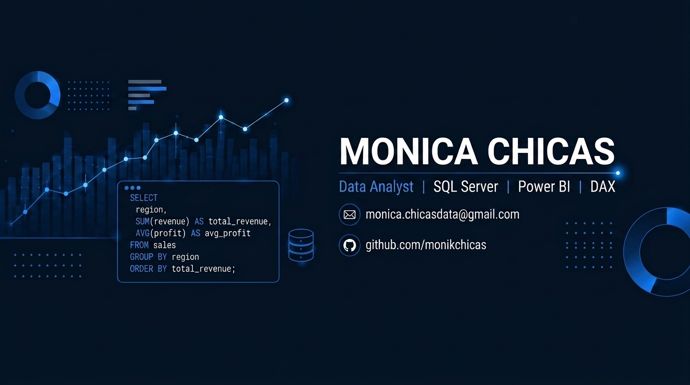

 

---

### Sobre mí

Analista de Datos en formación, con base en Ingeniería Industrial. Combina 
el pensamiento sistémico de la ingeniería: identificar cuellos de botella, 
medir procesos, optimizar resultados con herramientas de análisis de 
datos para convertir información en decisiones.

- Portafolio de proyectos de análisis de datos en construcción.
- Formación activa en funciones de ventana (SQL) y modelado de datos (DAX).
- Nivel de inglés B1 (EF SET).
- Disponible para conversar sobre oportunidades en Análisis de Datos / BI.

---

### Stack técnico

---

### Proyecto destacado

**[Análisis de Tiempos de Entrega — DataCo Global Supply Chain](https://github.com/monikchicas/supply-chain-analysis)**

Análisis de puntualidad en entregas y su impacto en la retención de
clientes, usando SQL Server para responder 5 preguntas de negocio y Power
BI + DAX para un dashboard interactivo. Incluye documentación completa
del proceso y las decisiones metodológicas.

`SQL Server` `Power BI` `DAX` `Análisis de negocio`

---

### Estadísticas de GitHub

---

Gracias por visitar mi perfil

